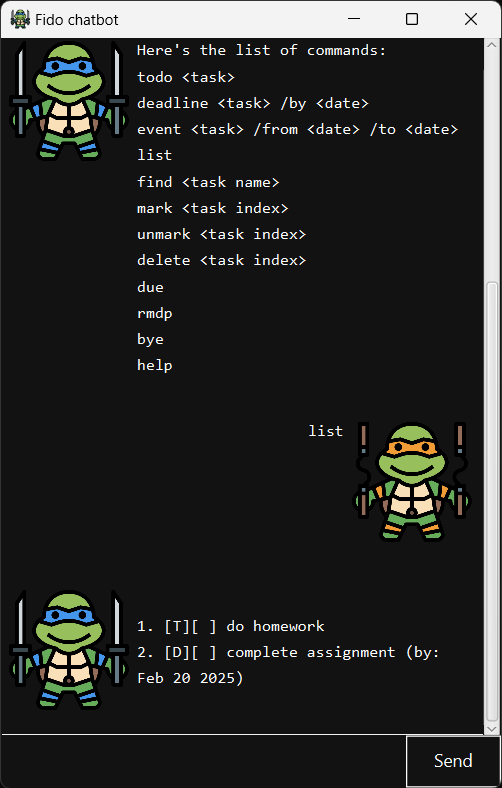

# Fido User Guide



Fido frees your mind of having to remember things you need to do. It's,
- text-based
- easy to use
- super fast to use

Icon Credit: <a href="https://www.flaticon.com/free-icons/cartoon" title="cartoon icons">Cartoon icons created by surang - Flaticon</a>

## Adding todos: `todo`

Adds a simple task.

**Format:**

```
todo [task_name]
```

**Expected output:**

```
added: [T][ ] drink water
```


## Adding deadlines: `deadline`

Adds a task with a deadline.

**Format:**

```
deadline [task_name] /by [YYYY-MM-DD]
```

**Expected output:**

```
added: [D][ ] drink water (by: Feb 20 2025)
```

## Adding events: `event`

Adds a task with a start and end dates.

**Format:**

```
event [task_name] /from [YYYY-MM-DD] /to [YYYY-MM-DD]
```

**Expected output:**

```
added: [E][ ] drink water (from: Feb 20 2025 to: Feb 21 2025)
```

## Displaying helps: `help`

Shows list of commands user can use.

**Format:**

```
help
```

**Expected output:**

```
Here's the list of commands:
todo <task>
deadline <task> /by <date>
...
```

## Listing all tasks: `list`

Shows all tasks stored.

**Format:**

```
list
```

**Expected output:**

```
1. [T][ ] drink water
2. [D][ ] drink water (by: Feb 20 2025)
3. [E][ ] drink water (from: Feb 20 2025 to: Feb 21 2025)
...
```

## Marking tasks as done: `mark`

Mark a task as complete by index.

**Format:**

```
mark [task_index]
```

**Expected output:**

```
This task has been marked as done.
  [T][X] drink water
```

## Unmarking tasks as done: `unmark`

Unmark a completed task by index.

**Format:**

```
unmark [task_index]
```

**Expected output:**

```
This task has been unmarked.
  [T][ ] drink water
```

## Deleting tasks: `delete`

Delete a task by index.

**Format:**

```
delete [task_index]
```

**Expected output:**

```
Following task has been removed:
  [T][ ] drink water
```

## Finding tasks: `find`

Find all tasks that contain certain keyword.

**Format:**

```
find [keyword]
```

**Expected output:**

```
Here's the list of tasks that contain drink:
  1. [T][ ] drink water
  2. [D][ ] drink water (by: Feb 20 2025)
  3. [E][ ] drink water (from: Feb 20 2025 to: Feb 21 2025)
```

## Finding due tasks: `due`

Find all tasks that are due or will be due in 1 day.

**Format:**

```
due
```

**Expected output:**

```
Here's the list of tasks that are due or will be due in 1 day:
  1. [T][ ] drink water
  2. [D][ ] drink water (by: Feb 20 2025)
  3. [E][ ] drink water (from: Feb 20 2025 to: Feb 21 2025)
```

## Removing duplicate tasks: `rmdp`

Remove all duplicate tasks.

**Format:**

```
rmdp
```

**Expected output:**

```
Removed duplicate.
```

## Exiting the chatbot: `bye`

Exit the chatbot.

**Format:**

```
bye
```

**Expected output:**

```
Have a nice day!
```